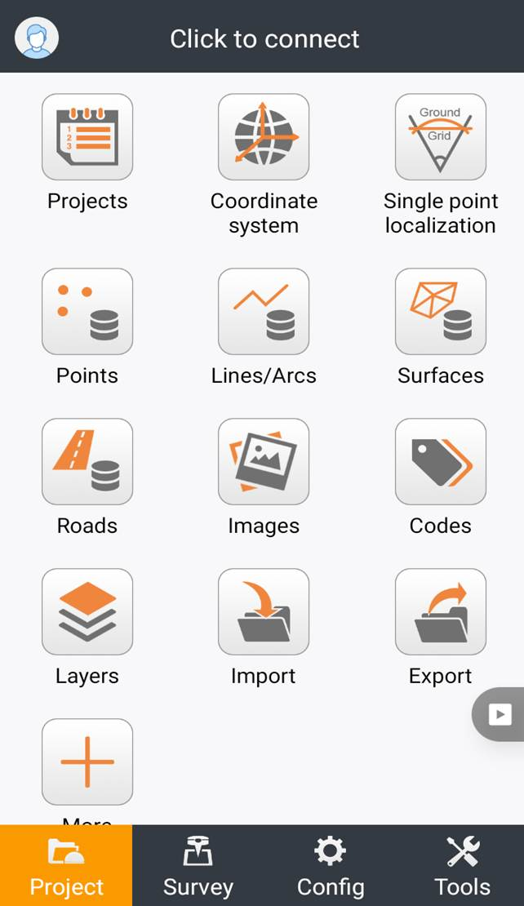
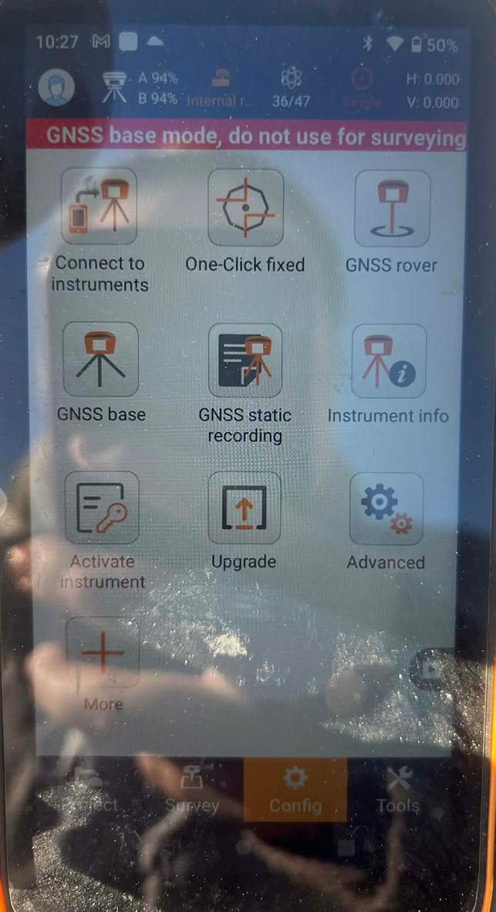

# CHCNAV багаж холбох үлгэрчилсэн заавар

&#x20; Landstar аппликэйшнээ нээгээд config цэсрүү очно.

.png>)

Config цэснээс connect to instruments-ийг сонгоно.

.png>)

Хатуу цэг дээр суурилуулсан BASE-ийн төхөөрөмжийн дугаарыг сонгож connect дарна.

Багажаа холбоод уншиж дууссаны дараа GNSS BASE-ийг сонгоно.

.png>).

External radio нь антенн болон модем залгасан үед сонгоно.

Internal radio нь антенн болон модем залгаагүй баттерейгаар холбож байгаа үед сонгож accept дарна.

.png>)

Antenna height хэсэг дээр хатуу цэг дээр зоосон багажны өндрийн метрээр хэмжиж тавина.

TYPE хэсэгт байгаа VERTICAL H нь хатуу цэг дээрх багажаа эгц босоо метрээр хэмжсэн бол сонгоно. Харин SLANT H нь хатуу цэг дээрх багажаа налуулж хэмжсэн үед сонгоно.

Select point хэсгийн list -рүү орно.

.png>)

Энэхүү list-үүд дундаас багажаа зоосон хатуу цэгийнхээ координатыг сонгоно.

.png>)

Антенны өндөр болон координатыг тохируулсаны дараа OK дарна.

.png>)

Config цэснээс connect to instruments-ийг сонгоно.

.png>)

Rover-ийнхөө төхөөрөмжийн дугаарыг сонгоод connect дарна.

Ингээд Base болон Rover FIX болно.

&#x20;

&#x20;
